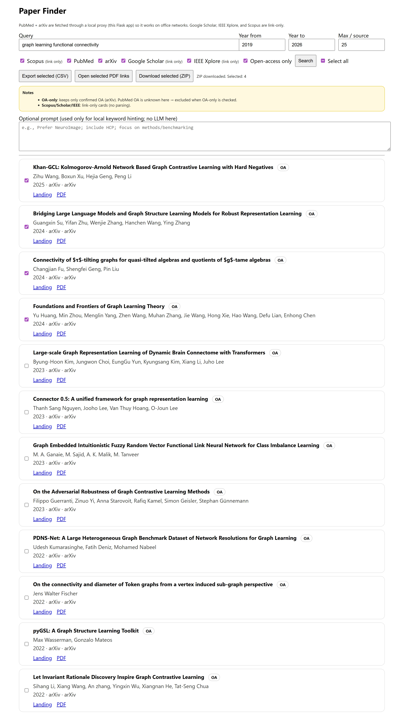

# <i class="fa-solid fa-magnifying-glass"></i> Paper-Finder

GUI-based tool for discovering, reviewing, and exporting academic papers across multiple databases.


---

## Overview

Paper-Finder is a lightweight, browser-based graphical user interface (GUI) that simplifies the process of searching for academic literature across multiple sources. It is designed for researchers who want a fast, transparent, and reproducible way to explore papers without relying on command-line tools or proprietary platforms.

The tool combines a local Flask backend (for reliable API access) with a clean HTML/JavaScript frontend, making it suitable for office networks, teaching environments, and collaborative research workflows.

Paper-Finder is especially useful as an early-stage literature discovery tool, before moving into systematic screening or automated review pipelines.

---

## Key Features

### ✅ Implemented Features

#### Multi-Source Search
- PubMed (via local proxy)
- arXiv (via local proxy)
- Google Scholar (link-only)
- IEEE Xplore (link-only)
- Scopus (link-only)

#### Graphical User Interface
- Runs entirely in the browser
- No command-line interaction required after setup
- Clear visual presentation of results

#### Year-Filtered Search
- Specify start and end publication years
- Filters applied consistently across sources

#### Open-Access Filtering
- Restrict results to confirmed open-access papers (currently arXiv)

#### Selection & Batch Actions
- Per-paper checkboxes
- “Select all” toggle with correct indeterminate state
- Batch export and download actions

#### Export Options
- Export selected papers to CSV
- Open all available PDF links in browser tabs
- Download selected papers as a ZIP archive, including:
  - Metadata CSV
  - Links file
  - PDFs (where available, e.g., arXiv)

#### Office-Network Friendly
- PubMed and arXiv requests are routed through a local Flask server
- Avoids common corporate firewall issues

---

## Main Capabilities

### Unified Discovery Interface
Search multiple academic sources from a single screen.

### Transparent Metadata Handling
Titles, authors, year, venue, source, open-access status, and links are clearly exposed.

### Manual Review Support
Designed for human-in-the-loop exploration rather than opaque automation.

### Reproducible Outputs
CSV and ZIP exports can be version-controlled or shared with collaborators.

---

## Getting Started

### Requirements
- Python 3.9+
- Internet access
- Modern web browser (Chrome, Firefox, Edge)

### Installation

Clone the repository:
```bash
git clone https://github.com/sanahassanimam/Automating-the-Information-Extraction
cd Automating-the-Information-Extraction/Paper-Finder
```

Install Python dependencies:
```bash
pip install flask requests
```

Start the local server:
```bash
python server.py
```

Open your browser and navigate to:
```
http://127.0.0.1:5174/search.html
```

That’s it — no additional setup required.

---

## How It Works

### Architecture

**Frontend**
- Plain HTML, CSS, and JavaScript
- No frameworks or build steps
- Runs entirely in the browser

**Backend**
- Flask server (`server.py`)
- Proxies PubMed and arXiv requests
- Generates ZIP exports server-side

### Data Flow
1. User submits a query via the GUI
2. Flask backend fetches results from PubMed and/or arXiv
3. Link-only sources generate direct search URLs
4. Results are merged and displayed in the browser
5. User selects papers and exports data as needed

---

## Exported Data

### CSV Export

The CSV file includes:
- Title
- Authors
- Publication year
- Venue / journal
- DOI (if available)
- Source database
- Open-access status
- PDF URL
- Landing page URL

This format is suitable for:
- Spreadsheet analysis
- Screening tools
- Downstream automation pipelines

### ZIP Export

The ZIP archive contains:
- `selected_papers.csv`
- `links.txt` (human-readable overview)
- `pdfs/` directory (when PDFs are available)
- `zip_log.txt` (summary of downloaded PDFs)

---

## Comparison with Other Tools

| Feature | Paper-Finder | CLI / Python Tools | Publisher Websites |
|------|-------------|------------------|-------------------|
| Interface | GUI (Browser) | Command-line | Web |
| Ease of Use | ⭐⭐⭐⭐⭐ | ⭐⭐ | ⭐⭐⭐ |
| Transparency | ⭐⭐⭐⭐⭐ | ⭐⭐⭐⭐ | ⭐⭐ |
| Automation | ⭐⭐⭐ | ⭐⭐⭐⭐⭐ | ⭐ |
| Reproducibility | ⭐⭐⭐⭐ | ⭐⭐⭐⭐⭐ | ⭐ |
| Setup Overhead | ⭐⭐⭐⭐ | ⭐⭐ | ⭐⭐⭐⭐⭐ |

---

## Use Cases

Paper-Finder is ideal for:
- Exploratory literature searches
- Early-stage systematic reviews
- Teaching literature search strategies
- Collaborative screening sessions
- Non-technical researchers
- Office or university network environments
- Preparing datasets for downstream review tools

---

## Limitations & Notes

- Google Scholar, IEEE Xplore, and Scopus are link-only (no scraping)
- PubMed open-access status is not resolved automatically
- PDF downloads depend on source availability (arXiv works best)
- Not intended as a full systematic review automation engine