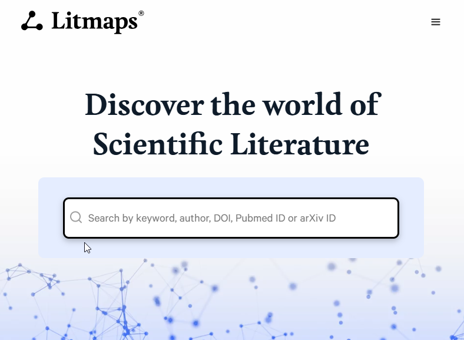
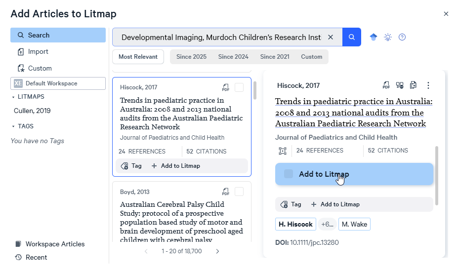
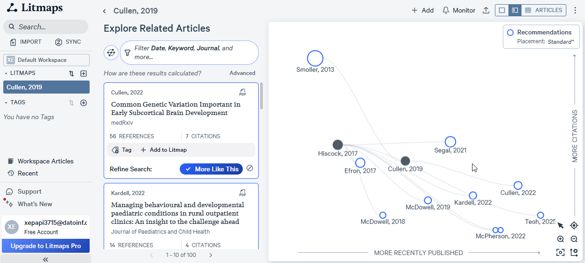

# 🗺️ LitMaps
## Overview

**LitMaps** is a free web-based tool that helps researchers discover literature through interactive citation network visualization. Instead of relying solely on keyword searches, LitMaps maps the connections between papers, making it easier to find influential works and trace research evolution.

**Website**: [https://app.litmaps.com/](https://app.litmaps.com/)

## Key Features

- 🗺️ **Interactive Citation Maps**: Visual network of paper relationships
- 🔍 **Discovery Mode**: Find papers connected to your seed papers
- 📊 **Timeline View**: See research evolution over time
- 🎯 **Relevance Scoring**: AI-powered paper importance ranking
- 📚 **Export Options**: BibTeX, RIS, CSV formats
- 🔄 **Auto-Updates**: Get notified of new related papers
- 👥 **Collaboration**: Share maps with team members

## Getting Started

### 1. Create an Account

Visit [https://app.litmaps.com/](https://app.litmaps.com/) and sign up for a free account using your email or Google account.



### 2. Start a New Map

There are three ways to create a citation map:

**Option A: Import from Reference Manager**
- Upload a BibTeX, RIS, or EndNote file
- Great for starting from existing literature reviews

**Option B: Search by DOI/Title**
- Enter DOIs or paper titles directly
- Useful when you know specific key papers

**Option C: Keyword Search**
- Search LitMaps database by keywords
- Good for exploratory research



## Basic Workflow

### Step 1: Add Seed Papers

Start with 3-10 "seed papers" - key papers that represent your research area:
(You can also simply use one paper to find related works - by citation or by similarity!)

```{admonition} Example
:class: tip
For a review on "transformers in NLP", you might use:
- "Attention Is All You Need" (Vaswani et al., 2017)
- "BERT: Pre-training of Deep Bidirectional Transformers" (Devlin et al., 2019)
- "GPT-3: Language Models are Few-Shot Learners" (Brown et al., 2020)
```
### Step 2: Explore the Citation Network

Once your seeds are loaded, LitMaps generates an interactive network showing:

- **Nodes**: Individual papers (size = citation count)
- **Edges**: Citation relationships (who cited whom)
- **Colors**: Time periods or relevance scores
- **Clusters**: Related research topics

**Navigation Controls:**
- 🖱️ **Drag**: Pan around the map
- 🔍 **Scroll**: Zoom in/out
- 🔘 **Click**: View paper details
- 🎯 **Filter**: Adjust date ranges and connections



### Step 3: Discover Related Papers

LitMaps uses several discovery methods:

**1. Citations & References**
- Papers that cite your seeds
- Papers cited by your seeds

**2. Co-Citation Analysis**
- Papers frequently cited together
- Indicates topical similarity

**3. Bibliographic Coupling**
- Papers sharing many references
- Shows methodological connections

### Step 4: Filter and Organize

Use LitMaps filters to refine your results:

- **Date Range**: Focus on specific time periods
- **Citation Count**: Filter by impact
- **Relevance Score**: AI-ranked importance
- **Publication Type**: Articles, reviews, preprints
- **Source**: Specific journals or conferences

```python
# Example: Exporting filtered results
# After filtering in LitMaps interface:
# 1. Select papers of interest
# 2. Click "Export" button
# 3. Choose format (BibTeX, RIS, CSV)
# 4. Download file
```
### Step 5: Monitor for New Papers
Get notified when new papers match your criteria:

1. Save your map with filters applied
2. Enable "Monitor for new papers"
3. Set notification frequency (daily/weekly)
4. Receive emails with new discoveries

**Integration Workflow**:

```python
# Step 1: Get papers from Research Buddy
from paper_searcher import PaperSearcher
searcher = PaperSearcher(config)
papers = searcher.search_all(query="your query")
searcher.generate_bibliography(papers, format="bibtex", output_file="initial_papers.bib")

# Step 2: Upload initial_papers.bib to LitMaps
# (Do this manually in the web interface)

# Step 3: Export expanded set from LitMaps
# Download expanded_papers.bib from LitMaps

# Step 4: Merge and deduplicate
# Use your preferred reference manager or Python
```

## Tips & Best Practices

### Choosing Good Seed Papers

✅ **Do**:
- Use highly-cited papers in your area
- Include recent papers (last 2-3 years)
- Mix review papers with original research
- Cover different aspects of your topic

❌ **Don't**:
- Use only very old papers (limited forward citations)
- Choose papers too broad or too narrow
- Start with more than 10-15 seeds (gets messy)

### Effective Exploration

1. **Start Broad, Then Narrow**
   - Begin with general seed papers
   - Use filters to progressively refine

2. **Follow Citation Chains**
   - Look 2-3 hops from seed papers
   - Both forward (who cites) and backward (what they cite)

3. **Check Multiple Time Periods**
   - Don't ignore older foundational works
   - But also track latest developments

4. **Use the Right View**
   - Network view: Find connections
   - Timeline view: Track evolution
   - List view: Detailed filtering

### Avoiding Common Pitfalls

⚠️ **Watch Out For**:

- **Echo Chambers**: Seed papers too similar → Limited discovery
  - *Solution*: Add diverse perspectives

- **Citation Bias**: Highly-cited ≠ Always relevant
  - *Solution*: Check abstracts, don't just trust metrics

- **Incomplete Networks**: Some papers missing from database
  - *Solution*: Cross-reference with traditional searches

- **Time Lag**: Recent papers may not have citations yet
  - *Solution*: Use keyword search for very recent work

## Comparison: LitMaps vs Traditional Methods

| Aspect | Traditional Search | LitMaps |
|--------|-------------------|---------|
| **Discovery** | Keyword-based | Citation network |
| **Visualization** | Lists | Interactive graph |
| **Completeness** | Easy to miss papers | Follow citation trails |
| **Time** | Manual tracking | Visual patterns |
| **Serendipity** | Low | High (find unexpected connections) |
| **Learning Curve** | Low | Moderate |

## Integration with Your Workflow

LitMaps works best as part of a multi-stage process:

```{mermaid}
graph LR
    A["Database Search<br>Research Buddy/Findpapers"] --> B[Initial Paper Set]
    B --> C["LitMaps<br>Citation Discovery"]
    C --> D[Expanded Paper Set]
    D --> E[Screening & Selection]
    E --> F[Final Review Set]
    
    style A fill:#e3f2fd
    style C fill:#fff3e0
    style F fill:#e8f5e9
```

1. **Initial Search**: Use Research Buddy or Findpapers for systematic database queries
2. **Citation Expansion**: Import results into LitMaps to find related papers
3. **Export**: Download expanded set for screening
4. **Validation**: Check against consensus tools (see [Consensus](3_Consensus))

## Limitations & Alternatives

### Limitations

- **Database Coverage**: May not include all niche journals
- **Recent Papers**: Very new papers lack citation data
- **API Access**: No programmatic API (manual export only)
- **Free Tier Limits**: Limited maps and updates

### Alternatives

- **Connected Papers** ([https://www.connectedpapers.com/](https://www.connectedpapers.com/))
  - Similar visual approach
  - Free with no account needed
  - Limited to 5 papers per search

- **Citation Gecko** (browser extension)
  - Works within Google Scholar
  - Lightweight option
  - Less sophisticated visualization

- **VOSviewer** (desktop software)
  - More powerful analytics
  - Steeper learning curve
  - Good for large-scale bibliometrics

## Resources

- 🌐 **Website**: [https://app.litmaps.com/](https://app.litmaps.com/)
- 📺 **Video Tutorials**: [LitMaps YouTube Channel](https://www.youtube.com/c/litmaps)
- 📚 **Help Center**: [https://help.litmaps.com/](https://help.litmaps.com/)
- 💬 **Community**: [LitMaps Twitter](https://twitter.com/litmaps)

---

:::{admonition} Next Tool
:class: tip
Continue to [Consensus](3_Consensus) to learn about AI-powered consensus finding!
:::
