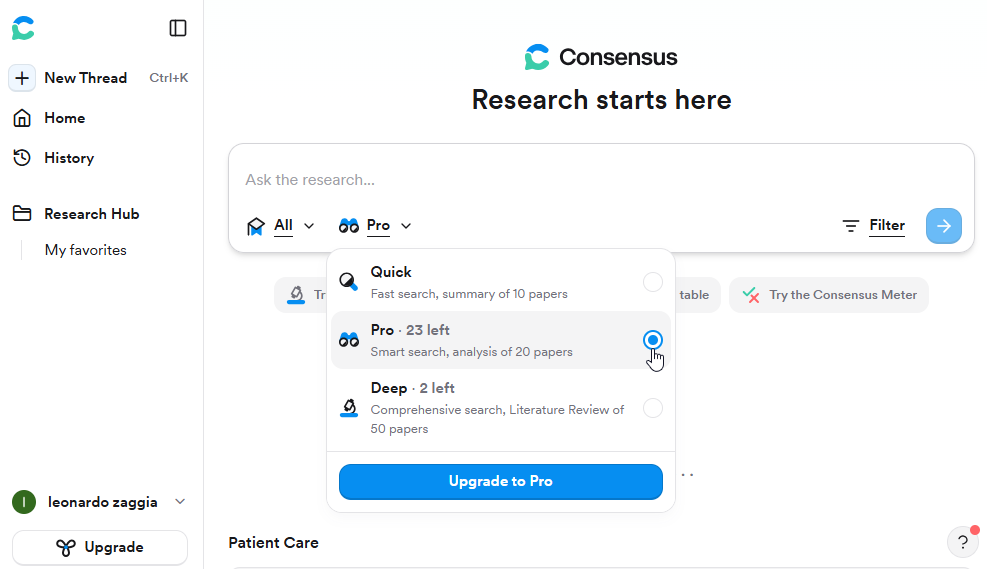
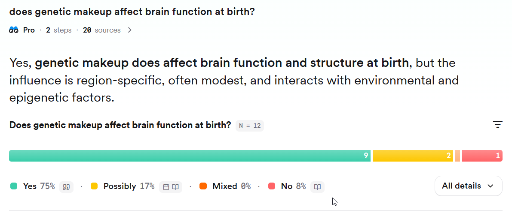

# ✅ Consensus

## Overview

**Consensus** is an AI-powered search engine designed specifically for scientific literature. Instead of just returning a list of papers, it synthesizes findings across studies to help you understand scientific consensus on a topic.

**Website**: [https://consensus.app/](https://consensus.app/)

## Key Features

- 🤖 **AI-Powered Synthesis**: Automatically summarizes findings across papers
- ✅ **Yes/No Questions**: Get consensus on specific claims
- 📊 **Evidence Quality**: See study types, sample sizes, and limitations
- 🔍 **200M+ Papers**: Covers multiple disciplines
- 📈 **Consensus Meter**: Visual indicator of agreement/disagreement
- 🎯 **Direct Answers**: No need to read 100 papers yourself
- 🆓 **Free Tier**: Generous free usage limits

## Getting Started

### 1. Create an Account

Visit [https://consensus.app/](https://consensus.app/) and sign up (optional for basic use, required for full features):

- Free tier: 20 Pro searches per month
- Pro tier: Unlimited searches + advanced features



### 2. Your First Search

The magic of Consensus is in asking the right questions:

**Good Questions (Yes/No format)**:
- "Does exercise improve mental health?"
- "Is intermittent fasting effective for weight loss?"
- "Do transformers outperform LSTMs for NLP tasks?"

**Also Works**:
- Open-ended: "What are the effects of caffeine on cognition?"
- Exploratory: "machine learning healthcare applications"

## Understanding Results

### Consensus Meter

After searching, Consensus shows a visual meter indicating scientific agreement:



### Paper Cards

Each result shows key information:

**Study Details**:
- 📄 Title and authors
- 📅 Publication year
- 📊 Study type (RCT, meta-analysis, observational)
- 👥 Sample size
- ⭐ Citation count

**AI Summary**:
- 🎯 How this paper answers your question
- 📌 Key findings extracted
- ⚠️ Limitations noted

### Evidence Quality Indicators

Consensus helps you assess study quality:

| Indicator | Meaning | Strength |
|-----------|---------|----------|
| 🥇 Meta-Analysis | Synthesis of multiple studies | Highest |
| 🔬 RCT | Randomized controlled trial | High |
| 📊 Cohort Study | Long-term observational | Medium |
| 📋 Cross-Sectional | Snapshot in time | Lower |
| 💭 Opinion/Review | Expert perspective | Context |

## Search Strategies

### 1. Yes/No Questions (Recommended)

Best for evaluating specific claims or hypotheses:

```
✅ Good Examples:
- "Does vitamin D supplementation prevent COVID-19?"
- "Are convolutional neural networks better than transformers for image classification?"
- "Is cognitive behavioral therapy effective for depression?"

❌ Avoid:
- "Tell me about vitamin D"  (too broad)
- "Vitamin D and COVID"  (not a question)
```

### 2. Comparative Questions

For comparing interventions, methods, or approaches:

```
- "Is drug A more effective than drug B for condition X?"
- "Do transformers outperform RNNs?"
- "Which diet is better for weight loss: keto or Mediterranean?"
```

### 3. Mechanism Questions

Understanding how/why something works:

```
- "How does exercise affect mental health?"
- "What is the mechanism of action of metformin?"
- "Why do transformers work better than RNNs?"
```

### 4. Exploratory Searches

Broad topic exploration:

```
- "machine learning drug discovery"
- "microbiome mental health"
- "climate change biodiversity"
```

### 5. Export & Citation

**Export Options**:
- 📄 PDF reports with AI summaries
- 📚 BibTeX for reference managers
- 📊 CSV for data analysis
- 🔗 Shareable links

**Citation Management**:
```python
# After exporting BibTeX from Consensus
# You can integrate with your workflow:

import bibtexparser

with open('consensus_export.bib', 'r') as f:
    bib_db = bibtexparser.load(f)

# Merge with other sources
papers = bib_db.entries
print(f"Found {len(papers)} papers with consensus support")
```

## Practical Use Cases

### Use Case 1: Hypothesis Validation

**Scenario**: You have a hypothesis for your research and want to know if there's existing evidence.

**Workflow**:
```
1. Frame hypothesis as yes/no question
   "Does social media use cause depression in adolescents?"

2. Search in Consensus

3. Review consensus meter and paper distribution
   - 60% Yes → Strong evidence
   - 20% Maybe → Some uncertainty
   - 20% No → Contradictory findings

4. Click into papers for details
   - Sample sizes
   - Methodological quality
   - Confounding factors

5. Decision:
   - Strong consensus → Consider different angle
   - Mixed results → Opportunity to clarify
   - Little evidence → Novel contribution possible
```

### Use Case 2: Literature Review Introduction

**Scenario**: Writing the introduction to your paper and need to cite consensus.

**Workflow**:
```
1. Search key claims in your introduction
   "Machine learning improves medical diagnosis accuracy"

2. Consensus shows: 85% Yes (42 studies)

3. Export top papers to BibTeX

4. Write introduction with strong citations:
   "Recent evidence demonstrates that machine learning 
    significantly improves diagnostic accuracy [1-5], 
    with meta-analyses showing consistent benefits..."

5. Full bibliography ready from export
```

### Use Case 3: Grant/Proposal Writing

**Scenario**: You need to establish the importance and current state of research.

**Workflow**:
```
1. Significance Section:
   Search: "Is [problem] a significant health concern?"
   → Cite consensus studies

2. Innovation Section:
   Search: "Does [current approach] adequately address [problem]?"
   → Show gaps/limitations in existing solutions

3. Approach Section:
   Search: "Is [your proposed method] effective?"
   → Build on preliminary evidence
```

### Use Case 4: Systematic Review Background

**Scenario**: You're conducting a systematic review and need to establish context.

**Workflow**:
```
1. Use Consensus for rapid background synthesis
   - Not for the systematic review itself!
   - Just for introduction/background sections

2. Identify key research questions

3. Design systematic search strategy

4. Conduct full systematic search (Research Buddy)

5. Screen papers systematically

6. Use Consensus to compare your findings with general consensus
```

**Integration Example**:
```python
# Step 1: Quick consensus check
# Go to consensus.app and search your question
# Export initial_consensus.bib

# Step 2: Systematic search with Research Buddy
from paper_searcher import PaperSearcher
searcher = PaperSearcher(config)
papers = searcher.search_all(query="your systematic query")

# Step 3: Compare coverage
# Are the consensus papers included in your systematic search?
# If not, why? (date range, database coverage, etc.)
```

## Tips & Best Practices

### Crafting Effective Queries

✅ **Do**:
- Use clear, specific questions
- Frame as yes/no when possible
- Include key terms and concepts
- Consider synonyms and alternatives

❌ **Don't**:
- Use overly complex questions
- Include multiple questions in one search
- Use jargon without plain language alternatives
- Expect perfect answers (AI synthesis has limitations)

### Interpreting Consensus

**Strong Consensus (>75% agreement)**:
- High confidence in finding
- Multiple replications
- Various study designs confirm

**Moderate Consensus (50-75%)**:
- General support with some uncertainty
- May depend on context/population
- Room for nuance

**Weak/Mixed Consensus (<50%)**:
- Contradictory evidence
- Context-dependent effects
- May indicate emerging area or complex phenomenon

### Critical Evaluation

⚠️ **Remember**:

1. **Check Study Quality**: High consensus from poor studies ≠ truth
2. **Look at Sample Sizes**: 10 studies with n=20 vs 2 studies with n=2000
3. **Consider Recency**: Fields change, older consensus may be outdated
4. **Understand Limitations**: AI summaries can miss nuance
5. **Read Original Papers**: For critical decisions, always verify

### When to Use Consensus

**✅ Good For**:
- Quick background research
- Hypothesis validation
- Grant/proposal writing
- Teaching and learning
- Science communication
- Exploratory research

**❌ Not Ideal For**:
- Systematic reviews (use as supplement only)
- Regulatory/clinical decisions (needs full review)
- Novel/cutting-edge topics (not enough papers)
- Very specific technical questions

## Comparison: Consensus vs Traditional Search

| Feature | Google Scholar | PubMed | Consensus |
|---------|---------------|--------|-----------|
| **Search** | Keyword | Medical Subject Headings (MeSH) | Natural language questions |
| **Results** | Paper list | Paper list | AI synthesis |
| **Consensus** | Manual analysis | Manual analysis | Automatic |
| **Speed** | Fast | Fast | Very fast |
| **Depth** | High (if you read all) | High (if you read all) | Medium (AI summary) |
| **Learning Curve** | Low | Medium | Very low |
| **Best For** | Comprehensive | Medical research | Quick synthesis |

## Limitations & Considerations

### Limitations

1. **Database Coverage**: May not include all niche journals or preprints
2. **AI Interpretation**: Summaries can miss subtle nuances
3. **Recency**: Very recent papers (last few weeks) may not be indexed
4. **Complex Topics**: Simple consensus may not capture complexity
5. **Language**: Primarily English-language papers

### Verification Strategy

Always verify critical findings:

```
Consensus Search → Identify key papers → Read abstracts → 
Read full text for critical claims → Verify methods → 
Check for conflicts of interest → Form your conclusion
```

### Complementary Tools

Use Consensus alongside:

- **Research Buddy/Findpapers**: Systematic database searches
- **LitMaps**: Citation network discovery
- **Elicit**: Detailed paper analysis
- **Traditional databases**: PubMed, Scopus, Web of Science

## Example Workflow: Complete Literature Review

```{mermaid}
graph TD
    A[Research Question] --> B["Consensus Search<br>Quick Overview"]
    B --> C{Existing Consensus?}
    C -->|Strong| D["Refine Question<br>Find Gap"]
    C -->|Weak/Mixed| E["Opportunity<br>to Clarify"]
    D --> F["Systematic Search<br>Research Buddy"]
    E --> F
    F --> G["Citation Discovery<br>LitMaps"]
    G --> H["Detailed Analysis<br>Elicit"]
    H --> I[Final Paper Set]
    
    style A fill:#e3f2fd
    style B fill:#fff3e0
    style F fill:#f3e5f5
    style I fill:#e8f5e9
```

1. **Consensus**: Understand current state (15 min)
2. **Research Buddy**: Systematic search (30 min)
3. **LitMaps**: Citation discovery (20 min)
4. **Elicit**: Deep analysis (variable)
5. **Traditional reading**: Final verification

## Resources

- 🌐 **Website**: [https://consensus.app/](https://consensus.app/)
- 📺 **Video Tutorials**: [Consensus YouTube](https://www.youtube.com/c/consensusapp)
- 📚 **Help Center**: [help.consensus.app](https://help.consensus.app/)
- 💬 **Community**: [Consensus Discord](https://discord.gg/consensus)
- 📖 **Blog**: [Consensus Blog](https://consensus.app/blog) - Research tips and updates

## Alternative Tools

If Consensus doesn't fit your needs:

- **Semantic Scholar**: [semanticscholar.org](https://www.semanticscholar.org/)
  - Similar AI features
  - Good for computer science
  - Free API available

- **Scite**: [scite.ai](https://scite.ai/)
  - Shows how papers cite each other (supporting/contrasting)
  - Good for evaluating claims
  - More focused on citation context

- **ResearchRabbit**: [researchrabbit.ai](https://www.researchrabbit.ai/)
  - Discovery and monitoring
  - Free unlimited use
  - Good for following topics over time

---

:::{admonition} Next Tool
:class: tip
Continue to [Elicit](4_Elicit) to learn about AI-powered paper analysis and data extraction!
:::
