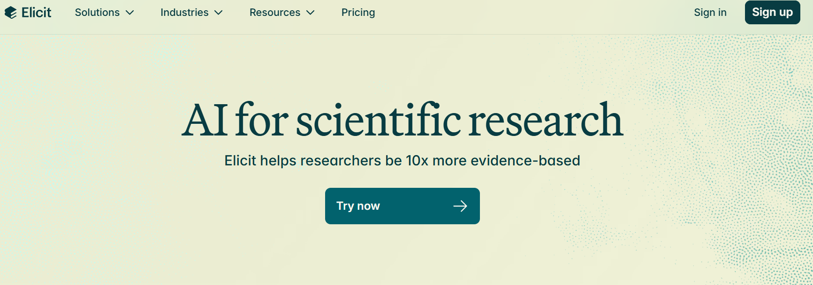

# <i class="fa-solid fa-arrows-spin"></i> Elicit

## Overview

**Elicit** is an AI-powered research assistant that goes beyond [Consensus](3_Consensus)'s quick synthesis by extracting custom data from papers and helping you screen large volumes of literature. While Consensus answers "what's the consensus?", Elicit answers "what specific data do I need from these papers?"

**Website**: [https://elicit.com/](https://elicit.com/)

**Key Difference from Consensus**:
- **Consensus**: Quick synthesis → "Do X interventions work?" → Yes/No with evidence
- **Elicit**: Data extraction → "Extract sample sizes, methods, outcomes from 100 papers" → Custom table ready for analysis

## Key Features

- 📊 **Custom Data Extraction**: Define any column, AI extracts from papers
- 🔍 **Bulk Screening**: Process 50-200+ papers efficiently  
- 📈 **Analysis Tables**: Structured data ready for meta-analysis
- 📝 **Paper Summaries**: AI-generated abstracts and key findings
- 🎯 **Question Answering**: Chat with individual papers
- 💾 **Export**: CSV/BibTeX with all extracted data
- 🆓 **Free Tier**: Limited monthly usage; paid plans for heavy users

## Getting Started

Visit [https://elicit.com/](https://elicit.com/) and sign up. Plans and usage limits change often - check the pricing page for the current free allowance before planning a large extraction.



## Main Use Case: Custom Data Extraction

**Perfect for**: Meta-analysis, systematic reviews, literature synthesis requiring structured data.

### Example: Extract RCT Details

1. **Search**: "randomized controlled trials cognitive behavioral therapy depression"

2. **Add Custom Columns**: Click "+ Add column"
   - "Sample size?"
   - "Intervention duration?"
   - "Control condition?"
   - "Primary outcome measure?"
   - "Effect size (Cohen's d)?"
   - "Dropout rate?"

3. **AI Extracts**: Elicit reads papers and fills columns automatically

4. **Review & Export**: Check accuracy, download CSV for meta-analysis

**Common Extraction Templates**:

```markdown
Medical Research:
- "Inclusion/exclusion criteria?"
- "Primary/secondary outcomes?"
- "Adverse events?"
- "Funding source?"

ML/AI Research:
- "Dataset used?"
- "Model architecture?"
- "Evaluation metrics?"
- "Code available?"

Social Science:
- "Sample demographics?"
- "Data collection method?"
- "Statistical approach?"
- "Effect sizes?"
```

## Integration with Review Buddy

**Recommended Workflow**:

1. **Comprehensive search** with Review Buddy: `python main.py --skip-download` writes every paper to `results/papers.csv`, and the papers that survived filtering to `results/papers_filtered.csv` (or `papers_filtered_ai.csv`).
2. **Extract the DOIs** for Elicit:
   ```python
   import pandas as pd

   papers = pd.read_csv("results/papers_filtered.csv")   # or papers_filtered_ai.csv
   dois = papers["DOI"].dropna()
   dois.to_csv("dois_for_elicit.txt", index=False, header=False)
   print(f"{len(dois)} DOIs written ({len(papers) - len(dois)} papers have no DOI)")
   ```
   Alternatively, upload `results/references_filtered.bib` directly, or the PDFs Review Buddy downloaded to `results/pdfs/`.
3. **Upload to Elicit** and define your extraction columns (manual step in the web interface).
4. **Download the structured CSV** - ready for analysis!

## When to Use: Elicit vs Consensus

| Use Case | Tool | Why |
|----------|------|-----|
| "What's the consensus on X?" | **Consensus** | Quick yes/no synthesis |
| "Extract sample sizes from 100 RCTs" | **Elicit** | Custom data extraction |
| "Does treatment A work?" | **Consensus** | Evidence overview |
| "Compare methods across 50 papers" | **Elicit** | Structured comparison |
| "Quick background research" | **Consensus** | Fast synthesis |
| "Meta-analysis data collection" | **Elicit** | Detailed extraction |
| "Teaching/learning" | Both | Consensus for overview, Elicit for depth |

**Combined Workflow**:
```
1. Consensus (15 min): Get overview and consensus
2. Review Buddy (30 min): Comprehensive search
3. Elicit (2-4 hours): Extract data and screen papers
4. Traditional reading: Verify and deep read
```

## Tips for Success

**Crafting Extraction Questions**:
- ✅ Specific: "What was the mean age of participants?"
- ❌ Vague: "Participant demographics?"
- ✅ Closed: "Was the study randomized? (Yes/No)"  
- ❌ Open: "Describe the study design"

**Best Practices**:
- Always verify critical data (sample sizes, effect sizes, p-values)
- Check AI citations (click to see source text)
- Start with 10-20 papers to test extraction quality
- Define all columns before processing to save credits

```{admonition} Warning
:class: warning
AI extractions are not error-free, and their accuracy varies with the field, the question and the paper. Always verify extracted values against the source text for publication-quality work - and report that you used an AI tool and how you checked it.
```

## Resources

- 🌐 [Elicit Website](https://elicit.com/)
- 📚 [Help Center](https://support.elicit.com/)
- 📖 [Blog](https://elicit.com/blog) - Tips and use cases

---

:::{admonition} Next Steps
:class: tip
- Compare with [Consensus](3_Consensus) for synthesis vs extraction
- See [Overview](0_Overview) for tool selection guide
- Explore complete workflows in documentation
:::

