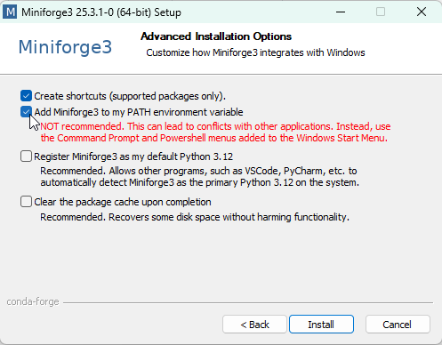

---
jupytext:
  formats: md:myst
  text_representation:
    extension: .md
    format_name: myst
    format_version: 0.13
    jupytext_version: 1.11.5
kernelspec:
  display_name: Python 3
  language: python
  name: python3
---

# <i class="fa-solid fa-download"></i> Environment Setup

This guide will walk you through setting up your environment for automated systematic literature searches.

## Prerequisites Check

Before we begin, let's check what you need:

::::{grid} 1 1 2 2
:gutter: 2

:::{grid-item-card} ✅ Required
- Python 3.7 or higher
- Package manager (conda/pip)
- Code editor (VS Code recommended)
- Internet connection
:::

:::{grid-item-card} 📚 Optional but Helpful
- Git (for version control)
- API keys (Scopus, IEEE)
- Institutional database access

:::

::::

## Step 1: Install Python Environment Manager

If you already have **Anaconda**, **Miniconda**, **Miniforge**, or **Mamba** installed, you can skip to [Step 2](#step-2-install-code-editor).

### Option A: Miniforge (Recommended)

Miniforge is a minimal conda installer with conda-forge as the default channel.

**Windows:**
1. Download the installer: [Miniforge3-Windows-x86_64.exe](https://github.com/conda-forge/miniforge/releases/latest/download/Miniforge3-Windows-x86_64.exe)
2. Run the installer and accept default options
3. At **Advanced Installation Options**, consider checking:
   - ✅ **"Add Miniforge3 to my PATH environment variable"** (recommended)
   
   
   
   :::{admonition} Why add to PATH?
   :class: tip
   Adding to PATH allows you to use `conda` commands from any terminal, not just the Miniforge Prompt.
   :::

**macOS/Linux:**
```bash
# Download and run the installer
wget https://github.com/conda-forge/miniforge/releases/latest/download/Miniforge3-Linux-x86_64.sh
bash Miniforge3-Linux-x86_64.sh
```

### Option B: Anaconda (Alternative)

Download from [anaconda.com/download](https://www.anaconda.com/download) and follow the installation wizard.

## Step 2: Install Code Editor

### Visual Studio Code (Recommended)

1. Download from [code.visualstudio.com](https://code.visualstudio.com/download)
2. Install with default settings
3. Install recommended extensions:
   - **Python** (by Microsoft)
   - **Jupyter** (by Microsoft)
   - **Markdown All in One**

:::{admonition} Alternative Editors
:class: note
You can also use **JupyterLab**, **PyCharm**, **Spyder**, or any editor you prefer.
:::

## Step 3: Create Virtual Environment

Virtual environments keep your project dependencies isolated. Let's create one for our systematic review tools.

### Open Your Terminal

**Windows:**
- If you added conda to PATH: Use PowerShell, Command Prompt, or Windows Terminal
- If not: Search for **"Miniforge Prompt"** in Start menu

**macOS/Linux:**
- Open Terminal application

### Create the Environment

```bash
# Create a new environment named 'autosearch' with Python 3.10
conda create -n autosearch python=3.10 -y
```

```bash
# Activate the environment
conda activate autosearch
```

You should see `(autosearch)` appear in your terminal prompt:

```
(autosearch) C:\Users\YourName>
```

:::{admonition} Environment Activation
:class: important
You'll need to activate this environment every time you start a new terminal session:
```bash
conda activate autosearch
```
:::

## Step 4: Install Review Buddy

Review Buddy is a production-ready toolkit for systematic reviews with a simple 3-step workflow.

### Clone the Repository

```bash
# Clone from GitHub
git clone https://github.com/leonardozaggia/review_buddy.git
cd review_buddy
```

Or download the ZIP file from GitHub and extract it.

### Install Dependencies

```bash
# Install required packages
pip install -r requirements.txt
```

This installs:
- Core dependencies (requests, lxml, beautifulsoup4, tqdm, bibtexparser)
- Optional: scholarly (Google Scholar), langdetect (language filtering)

### Configure API Keys

```bash
# Create .env file from template
cp .env.example .env
```

The `.env` file is already added to `.gitignore` to keep your keys private!

Edit `.env` file with your API keys (**at least one required**):

```bash
# Recommended: Scopus (best coverage)
SCOPUS_API_KEY=your_scopus_key_here

# Recommended: PubMed (biomedical papers)
PUBMED_EMAIL=your.email@example.com

# Optional but helpful
UNPAYWALL_EMAIL=your.email@example.com
IEEE_API_KEY=your_ieee_key_here
```

### Verify Installation

```bash
# Run a quick test
python 01_fetch_metadata.py
```

You should see available sources listed. See the [Review Buddy Installation Guide](../review_buddy/1_Installation) for detailed setup instructions.

## Step 5: Database API Keys (Optional)

Some databases require API keys for full access. Here's how to obtain them:

### Scopus API Key

1. Visit [Elsevier Developer Portal](https://dev.elsevier.com/)
2. Create an account or log in
3. Navigate to "My API Key"
4. Request an API key (may require institutional email)

### IEEE Xplore API Key

1. Visit [IEEE Developer Portal](https://developer.ieee.org/)
2. Create an account or log in
3. Navigate to "My APIs"
4. Request an API key (usually instant approval)

:::{admonition} Storing API Keys
:class: tip
To store your API keys as environment variables:

**Windows (PowerShell):**
```powershell
$env:IEEE_TOKEN = "your-ieee-api-key"
$env:SCOPUS_TOKEN = "your-scopus-api-key"
```

**macOS/Linux:**
```bash
export IEEE_TOKEN="your-ieee-api-key"
export SCOPUS_TOKEN="your-scopus-api-key"
```

For permanent storage, add these to your `.bashrc`, `.zshrc`, or PowerShell profile.

This step is optional, you can rely on the `.env` file -> see Step 4.
:::

## Step 6: Verify Your Setup

Let's run a quick test to ensure everything is working:

### For Review Buddy (Recommended)

```bash
# Navigate to review_buddy folder
cd review_buddy

# Run the fetch script
python 01_fetch_metadata.py
```

You should see available sources listed. If you see "No API keys configured", edit your `.env` file.

## Troubleshooting

### Common Issues

::::{grid} 1 1 1 2
:gutter: 2

:::{grid-item-card} ❌ "conda not recognized"
**Solution:** 
- Use Miniforge Prompt instead of regular terminal
- OR reinstall with "Add to PATH" option checked
:::

:::{grid-item-card} ❌ "Permission denied"
**Solution:**
- Run terminal as Administrator (Windows)
- Use `sudo` on macOS/Linux
- Check firewall/antivirus settings
:::

::::

## Quick Reference Card

```{code-block} bash
# Activate environment
conda activate autosearch

# Check findpapers version
findpapers version

# View available commands
findpapers --help

# Deactivate environment (when done)
conda deactivate
```

## What's Next?

🎉 **Congratulations!** Your environment is ready. Choose your path:

➡️ **[Review Buddy Tutorial](../review_buddy/0_Overview)** - Production-ready 3-step workflow with advanced filtering

## Additional Resources

- [Review Buddy Documentation](https://github.com/leonardozaggia/review_buddy)
- [Findpapers Issues](https://github.com/jonatasgrosman/findpapers/issues)
- [Python for Beginners](https://www.python.org/about/gettingstarted/)
- [PRISMA Guidelines](http://www.prisma-statement.org/)

---

:::{admonition} Need Help?
:class: tip
- 📖 [Conda Cheat Sheet](https://docs.conda.io/projects/conda/en/latest/user-guide/cheatsheet.html)
- 🎥 [VS Code Python Tutorial](https://www.youtube.com/watch?v=6i3e-j3wSf0)
- [https://github.com/leonardozaggia/review_buddy](https://github.com/leonardozaggia/review_buddy)

:::
