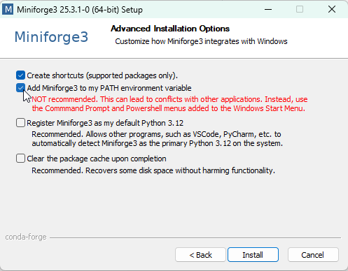

# <i class="fa-solid fa-download"></i> Environment Setup

This guide will walk you through setting up your environment for automated systematic literature searches.

## Prerequisites Check

Before we begin, let's check what you need:

::::{grid} 1 1 2 2
:gutter: 2

:::{grid-item-card} ✅ Required
- Python 3.10 or 3.11 (3.9 at minimum)
- Package manager (conda/pip)
- Code editor (VS Code recommended)
- Internet connection
:::

:::{grid-item-card} 📚 Optional but Helpful
- Git (for cloning and version control)
- API keys (Scopus, IEEE) and an email for PubMed
- Institutional database access
- Ollama (for AI screening), Node.js (for more PDF downloads)
:::

::::

## Step 1: Install Python Environment Manager

If you already have **Anaconda**, **Miniconda**, **Miniforge**, or **Mamba** installed, you can skip to [Step 2](#step-2-install-code-editor).

### Option A: Miniforge (Recommended)

Miniforge is a minimal conda installer with conda-forge as the default channel.

**Windows:**
1. Download the installer: [Miniforge3-Windows-x86_64.exe](https://github.com/conda-forge/miniforge/releases/latest/download/Miniforge3-Windows-x86_64.exe)
2. Run the installer and accept default options
3. At **Advanced Installation Options**, consider checking:
   - ✅ **"Add Miniforge3 to my PATH environment variable"** (recommended)
   
   
   
   :::{admonition} Why add to PATH?
   :class: tip
   Adding to PATH allows you to use `conda` commands from any terminal, not just the Miniforge Prompt.
   :::

**macOS/Linux:**
```bash
# Download and run the installer
wget https://github.com/conda-forge/miniforge/releases/latest/download/Miniforge3-Linux-x86_64.sh
bash Miniforge3-Linux-x86_64.sh
```

On macOS, download the `Miniforge3-MacOSX-arm64.sh` (Apple silicon) or `Miniforge3-MacOSX-x86_64.sh` (Intel) installer from the same [releases page](https://github.com/conda-forge/miniforge/releases/latest) instead.

### Option B: Anaconda (Alternative)

Download from [anaconda.com/download](https://www.anaconda.com/download) and follow the installation wizard.

(step-2-install-code-editor)=
## Step 2: Install Code Editor

### Visual Studio Code (Recommended)

1. Download from [code.visualstudio.com](https://code.visualstudio.com/download)
2. Install with default settings
3. Install recommended extensions:
   - **Python** (by Microsoft)
   - **Jupyter** (by Microsoft)
   - **Markdown All in One**
   - **YAML** (by Red Hat) - helpful for editing `config.yaml`

:::{admonition} Alternative Editors
:class: note
You can also use **JupyterLab**, **PyCharm**, **Spyder**, or any editor you prefer.
:::

## Step 3: Create Virtual Environment

Virtual environments keep your project dependencies isolated. Let's create one for our systematic review tools.

### Open Your Terminal

**Windows:**
- If you added conda to PATH: Use PowerShell, Command Prompt, or Windows Terminal
- If not: Search for **"Miniforge Prompt"** in Start menu

**macOS/Linux:**
- Open Terminal application

### Create the Environment

```bash
# Create a new environment named 'autosearch' with Python 3.10
conda create -n autosearch python=3.10 -y
```

```bash
# Activate the environment
conda activate autosearch
```

You should see `(autosearch)` appear in your terminal prompt:

```
(autosearch) C:\Users\YourName>
```

:::{admonition} Environment Activation
:class: important
You'll need to activate this environment every time you start a new terminal session:
```bash
conda activate autosearch
```
The name `autosearch` is not arbitrary: if you start Review Buddy's `main.py` from another environment that lacks its dependencies, it re-launches itself inside `autosearch` automatically.
:::

## Step 4: Install Review Buddy

Review Buddy is a toolkit for systematic reviews: search, screen and download, run with one command.

### Clone the Repository

```bash
# Clone from GitHub
git clone https://github.com/leonardozaggia/review_buddy.git
cd review_buddy
```

Or download the ZIP file from GitHub and extract it.

### Install Dependencies

```bash
# Install required packages
pip install -r requirements.txt
```

This installs everything Review Buddy uses: the core packages (requests, pandas, PyYAML, bibtexparser, rispy, ...), `curl_cffi` for reliable downloads, `langdetect` for language filtering, `scholarly` for Google Scholar, and the optional real-browser fetcher (`camoufox`, `playwright`). The [Review Buddy Installation Guide](../review_buddy/1_Installation) explains what each one is for.

### Configure API Keys

```bash
# Create .env file from template
cp .env.example .env
```

The `.env` file is already in Review Buddy's `.gitignore`, so your keys stay private.

Every line in `.env` starts commented out. Uncomment (remove the `#`) and fill in **only** the ones you have:

```bash
# Recommended: Scopus (best coverage)
SCOPUS_API_KEY=<your real key>

# Recommended: PubMed (biomedical papers) - any valid email
PUBMED_EMAIL=<your real email>

# Optional - leave commented out unless you have a value
#UNPAYWALL_EMAIL=
#IEEE_API_KEY=
```

:::{admonition} Don't leave placeholder values
:class: warning
An invented value such as `my_key_here` is sent to the API as a real key, and the API rejects every request - PubMed then returns 0 papers without an obvious error. Comment out what you don't fill in.
:::

### Create Your Run Configuration

```bash
# Create config.yaml from template
cp config.example.yaml config.yaml
```

`config.yaml` holds your query, years, databases and filters. You'll edit it in the [Usage Examples](../review_buddy/2_Usage_Examples).

### Verify Installation

```bash
# Show the available options
python main.py --help
```

See the [Review Buddy Installation Guide](../review_buddy/1_Installation) for a 1-minute test run and the optional services (Ollama, Zotero, real-browser fetcher).

## Step 5: Database API Keys (Optional)

Some databases require API keys for full access. Here's how to obtain them:

### Scopus API Key

1. Visit [Elsevier Developer Portal](https://dev.elsevier.com/)
2. Create an account or log in
3. Navigate to "My API Key"
4. Request an API key (may require institutional email)

### IEEE Xplore API Key

1. Visit [IEEE Developer Portal](https://developer.ieee.org/)
2. Create an account or log in
3. Navigate to "My APIs"
4. Request an API key

### PubMed

No key is needed - set `PUBMED_EMAIL` to any valid email. An optional `PUBMED_API_KEY` from your [NCBI account](https://account.ncbi.nlm.nih.gov/) raises the rate limit from 3 to 10 requests per second.

:::{admonition} Storing API Keys
:class: tip
The `.env` file from Step 4 is all you need. If you prefer real environment variables (for example on a shared server), use the **same names** Review Buddy reads from `.env`:

**Windows (PowerShell):**
```powershell
$env:SCOPUS_API_KEY = "your-scopus-api-key"
$env:IEEE_API_KEY = "your-ieee-api-key"
```

**macOS/Linux:**
```bash
export SCOPUS_API_KEY="your-scopus-api-key"
export IEEE_API_KEY="your-ieee-api-key"
```

For permanent storage, add these to your `.bashrc`, `.zshrc`, or PowerShell profile.
:::

## Step 6: Verify Your Setup

Let's run a quick check to ensure everything is working:

### For Review Buddy (Recommended)

```bash
# Navigate to review_buddy folder
cd review_buddy

# Check dependencies and credentials without downloading anything
python main.py --skip-download
```

`main.py` first runs a **preflight** check and lists anything that is missing, with the command to fix it - for example:

```
  ⚠ SCOPUS_API_KEY not set (Scopus will be skipped)
      Add it to .env
```

If preflight passes, it goes on to run the search and the filter with the query in `query.txt`, writing the results to `results/`.

## Troubleshooting

### Common Issues

::::{grid} 1 1 1 2
:gutter: 2

:::{grid-item-card} ❌ "conda not recognized"
**Solution:** 
- Use Miniforge Prompt instead of regular terminal
- OR reinstall with "Add to PATH" option checked
:::

:::{grid-item-card} ❌ "Permission denied"
**Solution:**
- Run terminal as Administrator (Windows)
- Use `sudo` on macOS/Linux
- Check firewall/antivirus settings
:::

::::

## Quick Reference Card

```{code-block} bash
# Activate environment
conda activate autosearch

# Run the full pipeline (search → keyword filter → download)
python main.py

# Same, with the AI (Ollama) filter
python main.py --ai

# Search and filter only, with another config file
python main.py --config my_review.yaml --skip-download

# View all options
python main.py --help

# Deactivate environment (when done)
conda deactivate
```

## What's Next?

🎉 **Congratulations!** Your environment is ready. Choose your path:

➡️ **[Review Buddy Tutorial](../review_buddy/0_Overview)** - One-command pipeline with keyword and AI screening

## Additional Resources

- [Review Buddy Documentation](https://github.com/leonardozaggia/review_buddy)
- [Review Buddy Issues](https://github.com/leonardozaggia/review_buddy/issues)
- [Python for Beginners](https://www.python.org/about/gettingstarted/)
- [PRISMA Statement](https://www.prisma-statement.org/)

---

:::{admonition} Need Help?
:class: tip
- 📖 [Conda Cheat Sheet](https://docs.conda.io/projects/conda/en/latest/user-guide/cheatsheet.html)
- 🎥 [VS Code Python Tutorial](https://www.youtube.com/watch?v=6i3e-j3wSf0)
- [https://github.com/leonardozaggia/review_buddy](https://github.com/leonardozaggia/review_buddy)

:::
