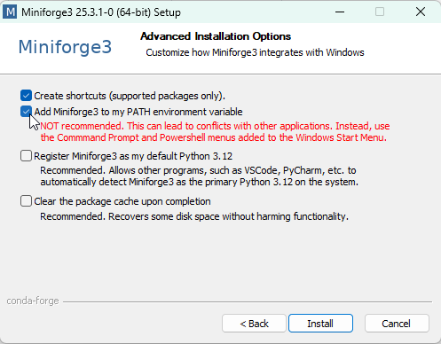

---
jupytext:
  formats: md:myst
  text_representation:
    extension: .md
    format_name: myst
    format_version: 0.13
    jupytext_version: 1.11.5
kernelspec:
  display_name: Python 3
  language: python
  name: python3
---

# 1.1 Installation

If you have the following tools, you can skip to [Create Environment](#create-environment) :

- Anaconda (miniconda) - Miniforge - Mamba - or your favorite flavor of **Package/Environment Manager**
- Code editor (e.g. Visual Studio code)

If you do not yet those tools on your machine, follow the next steps:

1. Install Miniforge. Click [here](https://github.com/conda-forge/miniforge/releases/latest/download/Miniforge3-Windows-x86_64.exe) to download the installer.
2. Accept the default options for installation untill you reach the **Advanced Installation Options**.
3. Optional: **"Add Miniforge3 to my PATH environment variable"**

  3. Recommended especially if you do not have other instances of python on your console, it allows you to call the conda commands from any terminal and not just the *Miniforge Prompt*
4. Download Visual Studio code, link [here](https://code.visualstudio.com/download)
5. Accept default untill the installation is complete.

## Create Environment

We now create and activate a virtual environment where we will install our automation tool: [findpapers](https://github.com/jonatasgrosman/findpapers?tab=contributing-ov-file).

If you added miniforge3 to `PATH` during installation, open any terminal and type the following comands. If the conda commands are not recognized, search for *Miniforge3 Prompt* on your laptop and use this dedicated terminal instead.

We will use python 3.10:

```bash
conda create -n autosearch python=3.10 -y
```
```bash
conda activate autosearch
```

Once the environment is activated `(autosearch)`, install the required dependency `edlib` from conda-forge, then install `findpapers`:

```bash
conda install -c conda-forge edlib -y    
```
```bash
pip install findpapers    
```

Finally, we are ready to start learning how to use **findpapers**.
